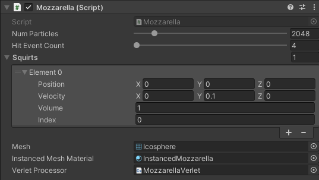

# MozzarellaTech


A gpu-based verlet solver that solves thousands of particle chains colliding with the depth buffer.

Communication between the GPU and CPU have been constrained for maximum performance.

## Installation
Simply add `https://github.com/naelstrof/MozzarellaTech.git#upm` as a package using the package manager.

## Usage
Simply add a Mozzarella monobehavior, and make sure it has at least one Squirt, one of the included materials, an arbitrary mesh, and the included MozzarellaVerlet compute shader added like so: 


To interact with how it spawns streams, simply create other monobehaviors that manipulate the Squirt positions/volumes/velocities.

## Spawning
The CPU sends a buffer of spawn locations every update, it's small and contains the following info:
```c#
public struct Squirt {
    public Vector3 position;
    public Vector3 velocity;
    public float volume;
    public uint index;
}
```
It allows you to spawn a new "stream" of particles with the provided world position, velocity, and particle volume. The index is automatically controlled as a "rolling" index.

## Simulating
Simulating the particles is done entirely on the GPU, they are constrained into a streams based on their volume, affected by gravity, and collide with the depth buffer!

## Collisions
Collisions are entirely simulated on the GPU using the depth buffer! Particles can bounce, get caught, and stretch on the depth buffer.

There's a tiny amount of GPU->CPU communication allocated for collision events! They are structured like so:
```c#
public struct HitEvent {
    public Vector3 position;
    public float volume;
}
```
With an event/observer pattern, you can subscribe to particle collision events, there's a limited amount of collisions that can happen per frame though.

Collisions are stored via a hash table, hash-collisions simply overwrite. It's pretty good at eventually calling an event for every particle on the screen.

You can use the collisions to do things like draw decals like so:


## Performance
Because there's very little CPU and GPU communication, this is almost as fast as your GPU can churn!


More than 16384 particles takes less than 1ms on a Nvidia 1080 ti.

## Graphics
The particles are limited to what you can design as a procedural draw call in Unity. I've included three examples.


None of them are allowed to draw during the opaque pass, since that would mean they'd show up on the depth buffer (causing self-collisions)! Shader Graph is unfortunately not capable of doing that yet, so all of these were designed with Amplify Shader Editor.
